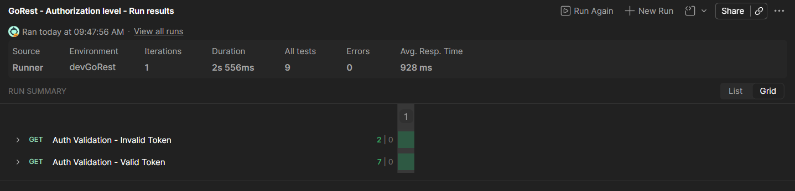
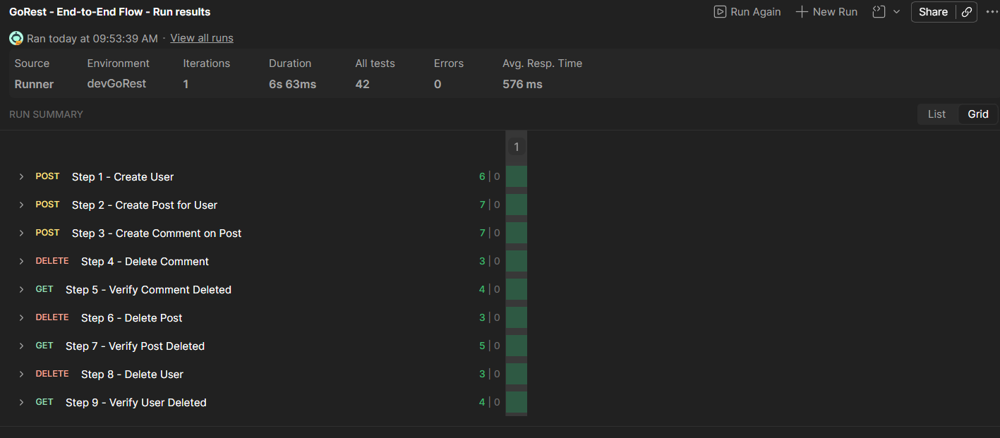
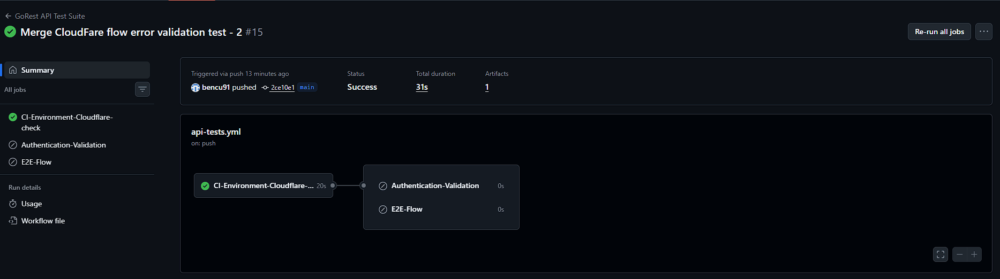
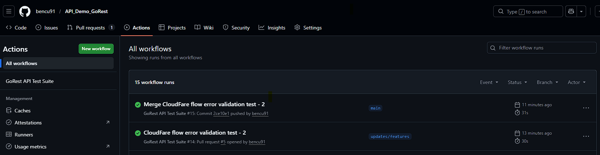

# GoRest API Test Framework

This is an API test automation framework built on top of the [GoRest](https://gorest.co.in) public REST API. I put this together using Postman collections and Newman so the tests can run from the command line or automatically through GitHub Actions on every push.

---

## Screenshots

### Collection 01 — Authentication Validation (Postman)


### Collection 02 — End-to-End Flow (Postman)


### Collection 03 — CI Environment Check (GitHub Actions)


### GitHub Actions — Full Pipeline Flow


### CI Environment Check — Sample Reports
These are real reports generated from the latest CI run. Open the HTML one in a browser for the full visual breakdown.

- [report-ci-check.html](docs/report-ci-check.html) — Human-readable report with pass/fail status, response times, and request details
- [report-ci-check.json](docs/report-ci-check.json) — Raw JSON output from Newman

---

## What's inside

| Tool | What it does |
|---|---|
| [Newman](https://github.com/postmanlabs/newman) | Runs Postman collections from the command line |
| [Postman Collections](https://www.postman.com/) | Where all the test cases and assertions live |
| [GitHub Actions](https://github.com/features/actions) | Runs the tests automatically on push and PR |
| Node.js 20+ | Runtime |

---

## Before you start

You'll need:
- Node.js 20 or higher
- A GoRest API token

**How to get your GoRest token:**
1. Head over to [gorest.co.in](https://gorest.co.in)
2. Sign in with your GitHub or Google account
3. Your token will be on the dashboard — copy it

---

## Setup

```cmd
:: Clone the repo
git clone https://github.com/bencu91/API_Demo_GoRest.git
cd API_Demo_GoRest

:: Install dependencies
npm install
```

Then open `environments\devGoRest.postman_environment.json` and paste your token into the `authToken` value field.

---

## How to run the tests

### With Node.js

```cmd
node runner.js
```

This picks up all collections automatically and runs them one by one.

### Run a single collection directly

```cmd
npx newman run collections\01-Authentication-Validation.postman_collection.json --environment environments\devGoRest.postman_environment.json
```

---

## CI/CD

Every push and pull request to `main` triggers the pipeline via GitHub Actions.

To make it work you need to add your token as a GitHub secret:
1. Go to your repo on GitHub
2. Settings → Secrets and variables → Actions
3. Add a new secret called `GOREST_TOKEN` and paste your token

**How the pipeline is structured:**

The pipeline runs three jobs. The first one always runs — it checks whether the GoRest API is accessible from the CI runner. The other two only kick in if that first check fails, which would mean the API became accessible and the full test suite should run.

| Job | What it does | When it runs |
|---|---|---|
| CI-Environment-Cloudflare-check | Validates the known Cloudflare restriction (expects 403) | Always |
| Authentication-Validation | Runs collection 01 against the live API | Only if Cloudflare check fails |
| E2E-Flow | Runs collection 02 against the live API | Only if Cloudflare check fails |

After each run, test reports are saved as downloadable artifacts and kept for 30 days. You can find them under the **Artifacts** section at the bottom of any completed GitHub Actions run.

| Artifact | Contents | Format |
|---|---|---|
| `Auth-validation-test-results` | Collection 01 results | JSON |
| `E2E-test-results` | Collection 02 results | JSON |
| `Cloud-results` | Collection 03 results | JSON + HTML |

The `Cloud-results` artifact includes both a JSON and a human-readable HTML report. Sample versions of both are available in the `docs/` folder — [report-ci-check.html](docs/report-ci-check.html) and [report-ci-check.json](docs/report-ci-check.json) — so you can see what the output looks like without having to run the pipeline.

---

## Known limitation — Cloudflare blocking CI requests

While setting up the CI pipeline I noticed that collections 01 and 02 were consistently failing with 403 errors, even though the tests were passing perfectly on my local machine. After investigating I found that GoRest sits behind Cloudflare, which automatically blocks requests coming from cloud server IPs — and GitHub Actions runners fall into that category.

As a workaround I created collection 03, which intentionally validates that block. Instead of treating the 403 as a failure, the test expects it and passes when Cloudflare is active. This keeps the pipeline green and documents the limitation clearly rather than leaving unexplained failures.

Collections 01 and 02 are fully validated locally and work as expected. They will run automatically in CI if the Cloudflare restriction is ever lifted.

---

## Project layout

```
API_framework/
├── collections/                          # Test collections, run in filename order
│   ├── 01-Authentication-Validation.postman_collection.json
│   ├── 02-End-to-End Flow.postman_collection.json
│   ├── 03-CI-Environment-Check.postman_collection.json
│   └── 04-Negative-Validation.postman_collection.json
├── environments/
│   └── devGoRest.postman_environment.json  # Local environment config (keep your token here)
├── data/
│   └── InputTestData.csv                 # Data-driven test input for collection 02
├── docs/                                 # Screenshots and supporting assets
├── reports/                              # Test output goes here (not tracked in git)
├── .github/workflows/
│   └── api-tests.yml                     # CI/CD pipeline definition
└── runner.js                             # The main runner script
```

---

## What the tests cover

### 01 — Authentication Validation
Checks that the API handles auth correctly:
- Sending an invalid token should return `401 Unauthorized`
- A valid token should return `200 OK` with the right response shape and within 2000ms

### 02 — End-to-End Flow
Walks through the full lifecycle of a user and their content, then cleans everything up:

| Step | What it does | What it checks |
|---|---|---|
| 1 | Create a user | 201, correct fields and types |
| 2 | Create a post for that user | 201, linked to the right user |
| 3 | Create a comment on that post | 201, linked to the right post |
| 4 | Delete the comment | 204, empty body |
| 5 | Confirm comment is gone | 404, error message present |
| 6 | Delete the post | 204, empty body |
| 7 | Confirm post is gone | 404, error message present |
| 8 | Delete the user | 204, empty body |
| 9 | Confirm user is gone | 404, error message present |

Response time under 2000ms is enforced via a collection-level script that runs automatically after every request. JSON structure and Content-Type are validated per request, since DELETE responses return empty bodies and those assertions don't apply there.

### 04 — Negative Validation
Tests the API's contract boundaries by sending invalid or incomplete requests to `POST /users` and asserting that the API returns `422 Unprocessable Entity` with a structured error response identifying the problematic field.

| Scenario | What it sends | What it checks |
|---|---|---|
| Missing name field | Request without `name` | 422, error targets `name` field |
| Invalid gender value | `gender: "unknown"` | 422, error targets `gender` field |
| Invalid email format | `email: "not-a-valid-email"` | 422, error targets `email` field |
| Duplicate email | Same email submitted twice | 422 on second attempt, error targets `email` field |
| Empty body | `{}` | 422, all required field errors present |

The duplicate email scenario is a two-step test — it creates a user first using a dynamically generated email (`Date.now()`), then attempts to register again with the same address. A cleanup step deletes the created user afterwards.

---

### 03 — CI Environment Check
While setting up the CI pipeline I ran into a problem — collections 01 and 02 were consistently failing with 403 errors in GitHub Actions, even though everything worked fine locally. Turns out GoRest sits behind Cloudflare, which blocks requests from cloud server IPs, and Actions runners fall into that category.

To handle this I created collection 03, which expects the 403 and passes when the block is active — keeping the pipeline green instead of leaving unexplained failures. It also acts as a gate: the job runs with `continue-on-error: true` and writes its result to a GitHub Actions output variable. Collections 01 and 02 read that variable and only run if the API is actually reachable. This way the conditional logic is explicit and readable rather than relying on job failure status as a signal.
